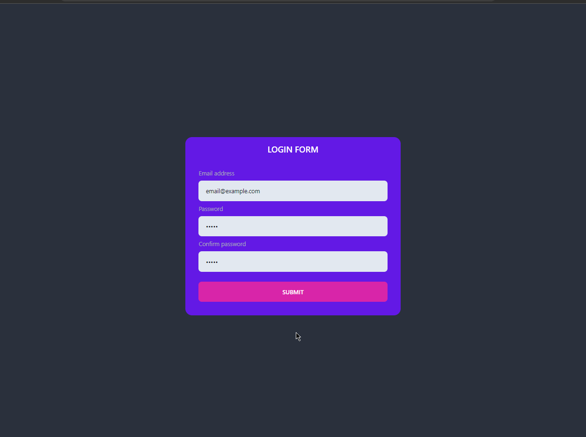

# Testing test

 

> This is a template for a new project based on Next.js and created with [bash scripts](https://github.com/SlyCooper-n/models)

 

## :pushpin: About

This project was created to practise some new concepts that I've been studying, like testing... Personaly I didn't think about working on this project so much in terms of style, but when I was finishing the tests I thought it would be interesting to put some nice stuff in there.

There are two folders:
- `web/`, which contains the website
- ~~`server/`, which contains the server~~ (it was replaced by Next.js API routes)

> For more information about my dev journey, consider visiting my [LinkedIn](https://linkedin.com/in/gabriel-vs-frasao).

## :hammer: Main tools and libs used

Base tools

- [Next.js](https://nextjs.org/)
- [Next.js API Routes](https://nextjs.org/docs/api-routes/introduction)
- [TypeScript](https://www.typescriptlang.org/)

Styling

- [Tailwind](https://tailwindcss.com/)
- [DaisyUI](https://daisyui.com/)
- [Framer Motion](https://www.framer.com/motion/)
- [Lottie](https://lottiefiles.com/)

Linters and Formatters

- [ESLint](https://eslint.org/)
- [Prettier](https://prettier.io/)
- [.editorConfig](https://editorconfig.org/)

Testing

- [Vitest](https://vitest.dev/)
- [React testing library](https://testing-library.com/docs/react-testing-library/intro/)
- [Cypress](https://www.cypress.io/)

## :sparkles: Features

- [x] `/rewards` API route
- [x] Smooth animtions on avatar click
- [x] Twitter-like like button with Lottie
